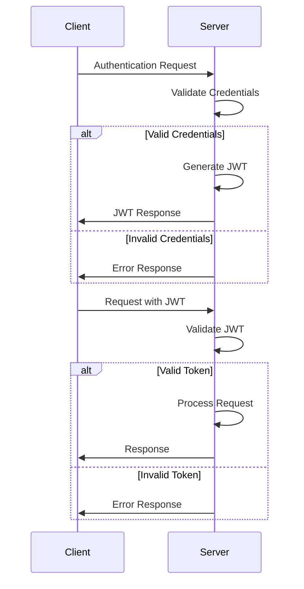

# Project Architecture and JWT Sequence Diagram

## Project Architecture

The project follows a typical NestJS architecture pattern, which is based on the MVC (Model-View-Controller) design pattern.

### Components:

1. **Controllers**: Responsible for handling incoming requests, processing input data, and returning responses to the client. They interact with services to perform business logic.

2. **Services**: Contain the business logic of the application. They handle data manipulation, perform CRUD operations, and interact with the database.

3. **Models**: Represent the data structures used in the application. They define the schema of objects stored in the database.

4. **Middleware**: Functions that run before the route handler. They can modify the request or response objects, or terminate the request early.

5. **Guards**: Used for authorization and authentication. They determine whether a request should be processed further based on certain conditions.

6. **DTOs (Data Transfer Objects)**: Plain JavaScript objects that define the structure of data transferred between the client and the server. They help ensure data consistency and prevent over-fetching or under-fetching of data.

### Workflow:

1. Incoming requests are routed to the appropriate controller based on the URL and HTTP method.

2. Controllers validate input data, perform any necessary transformations, and delegate business logic to services.

3. Services interact with models to perform CRUD operations on the database.

4. Responses are generated based on the results of database operations and returned to the client.

## JWT Sequence Diagram

The sequence diagram below illustrates the interaction between different components when a client requests authentication using JWT (JSON Web Tokens).

### Sequence Steps:

1. **Client Request**: The client sends a request to the server, typically containing credentials for authentication.

2. **JWT Creation**: Upon successful authentication, the server generates a JWT containing information about the user.

3. **Token Response**: The server sends the JWT back to the client as part of the response.

4. **Subsequent Requests**: The client includes the JWT in the headers of subsequent requests to the server.

5. **Token Validation**: Upon receiving a request, the server validates the JWT to ensure its authenticity and integrity.

6. **Response**: If the token is valid, the server processes the request and returns the appropriate response.

